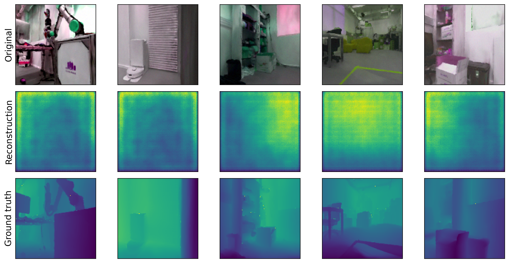

# Collision avoidance from monocular vision trained with novel view synthesis

## Installation

### Clone the Repository

First, clone the repository recursively to ensure all submodules are included:

```bash
git clone ... --recursive
```

### Conda Environment

Add the following line to `third_party/2d-gaussian-splatting/submodules/simple-knn/simple_knn.cu` (source: [PyTorch Audio PR #3811](https://github.com/pytorch/audio/pull/3811/files)):

```cpp
#include <float.h>
```

Now, create the `vision_agent` conda environment:

```bash
conda env create -f environment.yaml
conda activate vision_agent
```

## Creating a GS Dataset

### Camera Settings

TODO: Provide camera setup instructions.

### Capture Tips

TODO: Include tips for capturing images.

### COLMAP

Instructions for using COLMAP.

## Getting the Vision and Collision Mesh

Train the Gaussian Splatting model and render the mesh:

```bash
cd third_party/2d_gaussian_splatting
python train.py -s <path to COLMAP or NeRF Synthetic dataset>
python render.py -m <path to trained model> --skip-train --skip-test
```

If you encounter an incomplete mesh, you may need to adjust the `--sdf_trunc` or `--depth_trunc` parameters.

Next, decompose the mesh into convex subparts:

```bash
python coacd.py --mesh <path to your mesh>
```

You may need to tweak the `--preprocess_resolution` and `--threshold` parameters.

Afterwards, open the mesh in Blender, remove the ground and any artifacts, and save the processed mesh as `manual_postprocess.obj`.

Finally, generate a URDF to load the mesh in Pinocchio:

```bash
cd third_party/obj2urdf
python obj2urdf.py <path to the file.obj>
```

Copy `manual_postprocess.obj`, `manual_postprocess.urdf`, and `point_cloud.ply` to the `data` folder.

## Train and Test Your Navigation Policy

### Collect the Dataset

Collect some RGB and depth images to train the visual encoder:

```bash
python make_dataset.py
```

By default, the dataset will have 60,000 samples, but you can adjust this with the `--len_dataset` parameter.

### Train the Vision Encoder

Train the vision encoder:

```bash
python autoencoder.py
```

This script will also visualize the image, depth reconstruction, and depth ground truth at the end of training. Use the `--skip_train` argument to skip training and only view the visualizations. You can also adjust the batch size and number of epochs with the `--batch_size` and `--epochs` parameters.



### Train Your Navigation Policy

Now, you’re ready to train your navigation policy:

```bash
python train_policy.py
```

You can adjust the number of training steps with the `--training_steps` parameter.

### Test Your Navigation Policy

To test the navigation policy:

```bash
python test_nav_policy.py
```

This will open a window showing the agent’s behavior when instructed to go full throttle forward.

## Trying It Out on Upkie!

### In Simulation

1. In one terminal, start the Upkie simulation:

```bash
git clone https://github.com/upkie/upkie.git
cd upkie
./start_simulation.sh
```

2. In another terminal, run the agent:

```bash
python run.py
```

This will open a window to visualize the FPV of the robot. With a joystick connected, your policy will correct your joystick inputs to avoid collisions.

### On Your Real Upkie

1. In one terminal, reset the Upkie system:

```bash
upkie_tool rezero
make run_pi3hat_spine
```

2. In another terminal, run the agent:

```bash
python run.py
```
